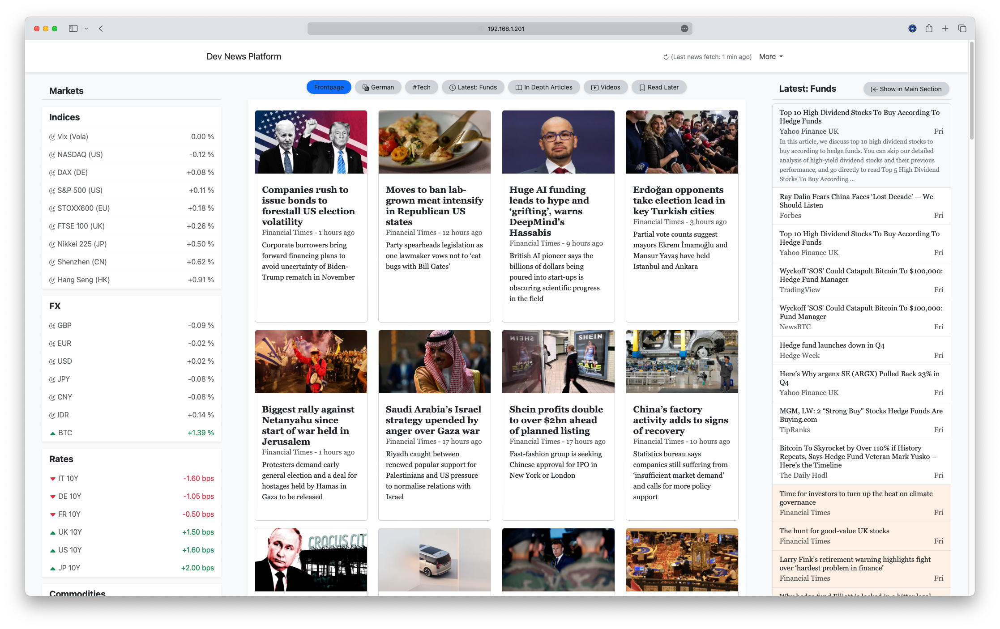
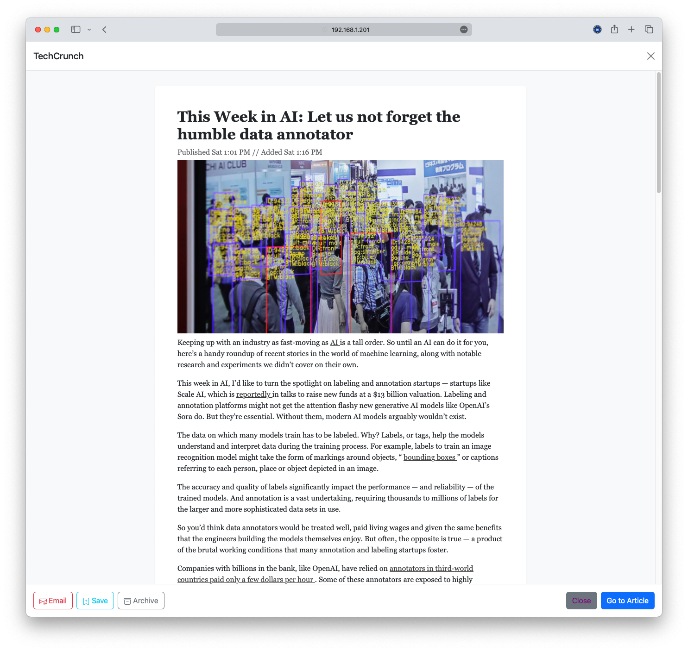
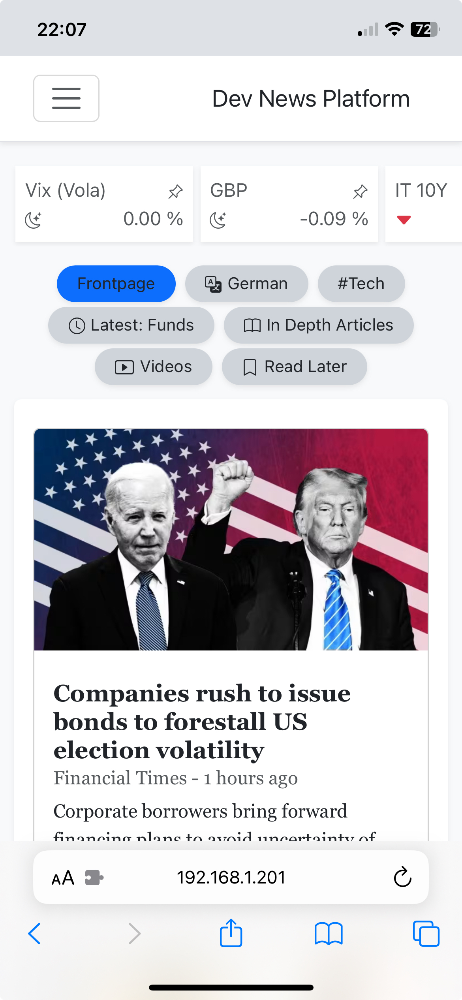

# Personal News Platform
[Go to **Documentation & How-To**](https://vanalmsick.github.io/news_platform/)  
[Go to **DockerHub Container: vanalmsick/news_platform**](https://hub.docker.com/repository/docker/vanalmsick/news_platform)  

News Aggregator - Aggregates news articles from several RSS feeds, fetches full-text if possible, sorts them by relevance (based on user settings), and display on distraction-free homepage.

### PC Home Page:
<br>  
### Article Reading View:
<br>  
### Phone Home Page:
<br>  


## Quick Start / TL;DR
*(Make sure Docker is installed: [go to docker.com](https://www.docker.com/get-started/))*  

**Minimal Docker Run Command (CMD):**
```
docker run \
    -p 80:80 \
    -v /your/local/data/dir/news_platform:/news_platform/data \
    --name my_news_platform \
    vanalmsick/news_platform
```

**All out [docker_compose.yml](https://vanalmsick.github.io/news_platform/docker_compose.yml.template) setup:**  
*docker_compose.yml:*
```
version: "3.9"

services:

  # The News Plattform
  news-platform:
    image: vanalmsick/news_platform
    container_name: news-platform
    restart: always
    ports:
      - 9380:80    # for gui/website
      - 9381:5555  # for Celery Flower Task Que
      - 9382:9001  # for Docker Supervisor Process Manager
    depends_on:
      - news-platform-letsencrypt
    volumes:
      - /your/local/data/dir/news_platform:/news_platform/data
    environment:
      MAIN_HOST: 'https://news.yourwebsite.com'
      HOSTS: 'http://localhost,http://127.0.0.1,http://0.0.0.0,http://docker-container-name,http://news.yourwebsite.com,https://news.yourwebsite.com'
      CUSTOM_PLATFORM_NAME: 'Personal News Platform'
      SIDEBAR_TITLE: 'Latest News'
      TIME_ZONE: 'Europe/London'
      ALLOWED_LANGUAGES: 'en,de'
      FULL_TEXT_URL: 'http://fivefilters:80/full-text-rss/'
      FEED_CREATOR_URL: 'http://fivefilters:80/feed-creator/'
      WEBPUSH_PUBLIC_KEY: '<YOUR_WEBPUSH_PUBLIC_KEY>'
      WEBPUSH_PRIVATE_KEY: '<YOUR_WEBPUSH_PRIVATE_KEY>'
      WEBPUSH_ADMIN_EMAIL: 'admin@example.com'
      OPENAI_API_KEY: '<YOUR_OPEN_AI_API_KEY>'
    labels:
      - "com.centurylinklabs.watchtower.enable=true"  # if you use Watchtower for container updates


  # HTTPS container for secure https connection [not required - only if you want https]
  news-platform-letsencrypt:
    image: linuxserver/letsencrypt
    container_name: news-platform-letsencrypt
    restart: always
    ports:
      - 9480:80   # incomming http
      - 9443:443  # incomming https
    volumes:
      - news_platform_letsencrypt:/config
    environment:
      - EMAIL=<YOUR_EMAIL>
      - URL=yourwebsite.com
      - SUBDOMAINS=news
      - VALIDATION=http
      - TZ=Europe/London
      - DNSPLUGIN=cloudflare
      - ONLY_SUBDOMAINS=true
    labels:
      - "com.centurylinklabs.watchtower.enable=true"  # if you use Watchtower for container updates


volumes:
  news_platform:
  news_platform_letsencrypt:
```
*start-up command (CMD):*
```
docker compose -f "/your/local/path/docker_compose.yml" up --pull "always" -d
```

## Environmental Variables:
| ENV-KEY              | Possible Value                              | Default Value                        | Description                                                                                                                                                                                                                                                                                                                       |
|----------------------|---------------------------------------------|--------------------------------------|-----------------------------------------------------------------------------------------------------------------------------------------------------------------------------------------------------------------------------------------------------------------------------------------------------------------------------------|
| MAIN_HOST            | (any str)                                   | "http://localhost"                   | Public/local-network facing main URL. Used for links e.g. for webpush push notifications e.g. "https://news.yourwebsite.com" or "http://19.168.172.100"                                                                                                                                                                           |
| HOSTS                | (any str)                                   | "http://localhost,http://127.0.0.1/" | List of urls to access news platfrom from. Required to avoid CSRF errors from CSRF attack protection e.g. "http://localhost,http://127.0.0.1,http://0.0.0.0,http://docker-container-name,http://news.yourwebsite.com,https://news.yourwebsite.com"                                                                                |
| CUSTOM_PLATFORM_NAME | (any str)                                   | "Personal News Platform"             | Name of news plattform e.g. "John doe's Personal News Platform"                                                                                                                                                                                                                                                                   |
| SIDEBAR_TITLE        | (any str)                                   | "Latest News"                        | Name of sidebar news section e.g. "News Ticker"                                                                                                                                                                                                                                                                                   |
| TIME_ZONE            | (iso str per ICANN tz database name)        | "Europe/London"                      | Server time-zone as per official ICANN tz name e.g "Europe/Berlin"                                                                                                                                                                                                                                                                |
| ALLOWED_LANGUAGES    | (str list of ISO 639-2)                     | "*"                                  | List of languages in which articles are allowed e.g. "en,de". This is to exclude languages the user does not understand that might be from topic feeds e.g. all articles tagged with "Tech" which might be in English, German, Chines, Spanish etc.                                                                               |
| LANGUAGE_CODE        | (two letter language-country ISO code)      | "en-UK"                              | ISO code of News Plattform's language and loclaization for internet browser e.g. "en-US" or "de-DE"                                                                                                                                                                                                                               |
| FULL_TEXT_URL        | (url to fivefilters full-text-rss instance) | "http://ftr.fivefilters.org/"        | A local instance of [fivefilters full-text-rss](https://www.fivefilters.org/pricing/) is required for full-text fetching currently - working on own full-text fetcher.                                                                                                                                                            |
| FEED_CREATOR_URL     | (url to fivefilters feed-creator instance)  | None                                 | Local instance of [fivefilters feed-creator](https://www.fivefilters.org/pricing/) if webpages don't have a rss feed to create an rss feed - working on own feed-creator.                                                                                                                                                         |
| WEBPUSH_PUBLIC_KEY   | (str of public vapid-key)                   | "<hard-coded-key>"                   | Get your own public & private keys for webpush push-notifications e.g. from [web-push-codelab.glitch.me](https://web-push-codelab.glitch.me) or follow these instructions [Google Dev Documentation](https://developers.google.com/web/fundamentals/push-notifications/subscribing-a-user#how_to_create_application_server_keys). |
| WEBPUSH_PRIVATE_KEY  | (str of private vapid-key)                  | "<hard-coded-key>"                   | Get your own public & private keys for webpush push-notifications e.g. from [web-push-codelab.glitch.me](https://web-push-codelab.glitch.me) or follow these instructions [Google Dev Documentation](https://developers.google.com/web/fundamentals/push-notifications/subscribing-a-user#how_to_create_application_server_keys). |
| WEBPUSH_ADMIN_EMAIL  | (str email address)                         | "news-platform@example.com"          | Email address to get notified in case something is wrong with the webpush push notification sending.                                                                                                                                                                                                                              |
| OPENAI_API_KEY       | (str of openai api key)                     | None                                 | Open AI API key for artcile summaries.                                                                                                                                                                                                                                                                                            |
| SECRET_KEY           | (str of django secret key)                  | "<hard-coded-key>"                   | Django's production secret key.                                                                                                                                                                                                                                                                                                   |
| DEBUG                | True, False [!!!Currently only True works]  | True                                 | To run the news platform in production / dev modus. Currently the production modus does not work.                                                                                                                                                                                                                                 |
| TESTING              | True, False                                 | False                                | To run the news platfrom in real-life testing modus - i.e. fetiching only 10% of news sources to avoid waiting.                                                                                                                                                                                                                   |

These environmental variables can be
+ included in the docker_compose.yml file in section "environment:" as arguments *(as above in the docker_compose.yml example)*,
+ saved as an .env file [*(example)*](/template.env) and passed to the docker_compose.yml file as argument "env_file: /your/local/dir/.env", or
+ saved as an .env file [*(example)*](/template.env) in the news plattform container's data directory e.g. "/your/local/data/dir/news_platform/.env"


## More information available in the [Documentation](https://vanalmsick.github.io/news_platform/)
## How to [contribute & help add features](https://vanalmsick.github.io/news_platform/)
