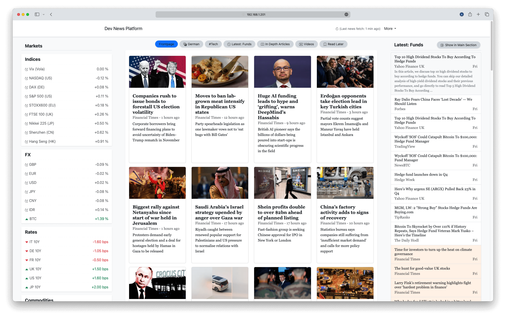
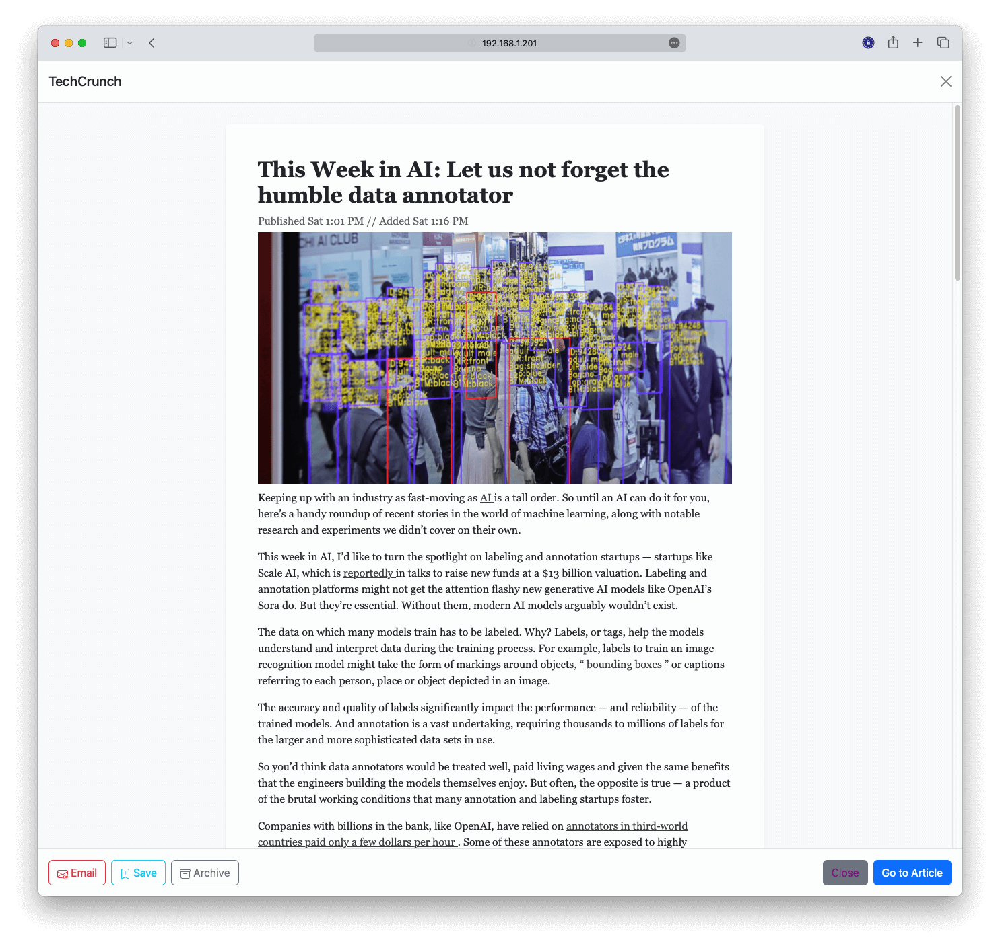

# Personal News Platform

News Aggregator - Aggregates news articles from several RSS feeds, fetches full-text if possible, sorts them by
relevance (based on user settings), and display on distraction-free homepage.

### Preview - PC Home Page

{ width=90% } 

### Preview - Article Reading View

{ width=65% }

### Preview - Phone Home Page

{ width=50% } 

## Features

- News article fetching from RSS feeds and videos from YouTube channels
- Full-text article fetching where possible (currently using fivefilters.org full-text fetcher - later own full-text
  fetcher)
- Market data fetching
- Light/dark modus website
- Responsive optimized for very large screens, large screens, tablets, phones
- Webapp
- Push notifications
- Custom news sources, article sorting, news-sections/pages, news-ticker/sidebar
- Article previews when sharing a link e.g. via iMessage, WhatsApp, MS Teams
- Reading list & archive
- Still functionable in browsers with JavaScript disabled (aka paranoid-modus)
- All self-hosted without cookies & tracker (except required ones from Bootstrap style)
- Optimized to run on low-power servers like RaspberryPi 3 and later
